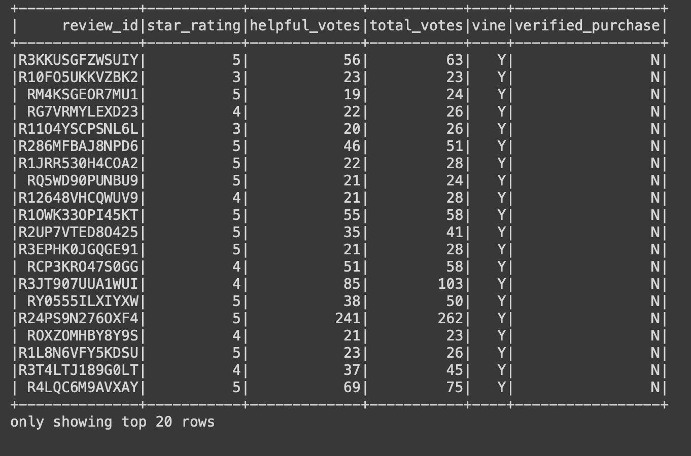
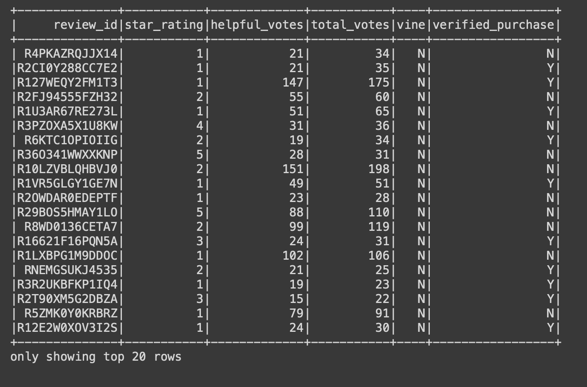
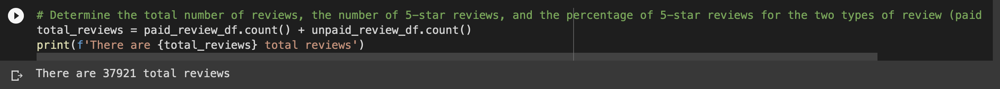
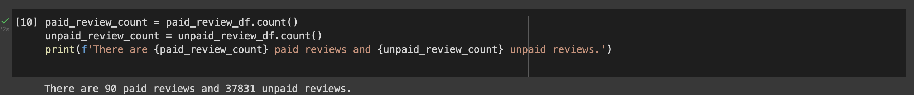
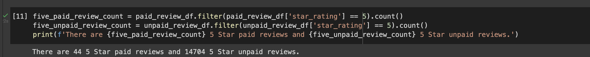
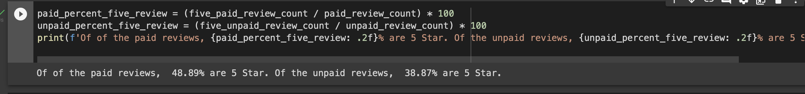

# Amazon Vine Analysis

## Overview

This assignment consists of two technical analysis deliverables and a written report. 

Deliverable 1: Perform ETL on Amazon Product Reviews

Deliverable 2: Determine Bias of Vine Reviews

Deliverable 3: A Written Report on the Analysis (README.md)

The purpose of this assignment is to determine the total number of reviews, the number of 5-star reviews, and the percentage of 5-star reviews for the two types of review (paid vs unpaid).

## Results
After cleaning the data, the paid & unpaid dataframe were created.

Here is the Paid Dtatframe screenshot.

Here is the Unpaid Dataframe screenshot.

The count of each DataFrame gave us the following results

The count on the paid & unpaid reviews is

The number of 5 Star reviews was calculated for each,

And the percentage of 5 Star reviews

## Summary

A few conculsion can be drawn from this dataset & analysis, one is that there is a bias positive paid review, at 10% higher for paid vs unpaid. To note is that there is only 90 paid reviews, compared to over 37,000 unpaid.

What we see in this analysis is that, the analysis does not take into consideration whether or not those who left a review were able to view previous reviews of others before they made their own review of the video game. Positive reviews may influence others to also leave positive reviews or lessen the negative impact of the review.

One additional analysis I would suggest, is that to perform the analysis on a similar stream of products. By assessing any bias in another dataset that strengthens the results of this dataset.